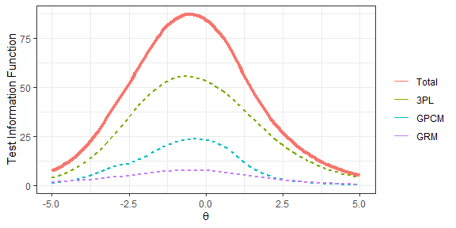
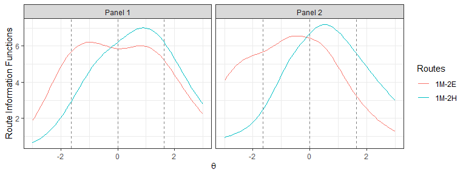
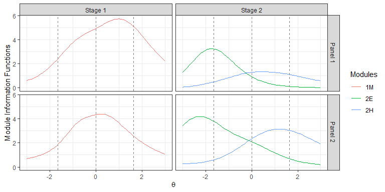
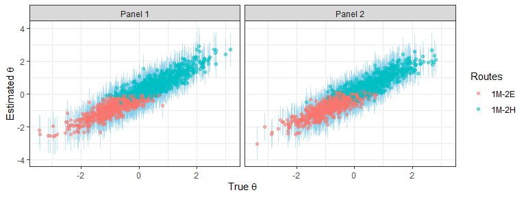
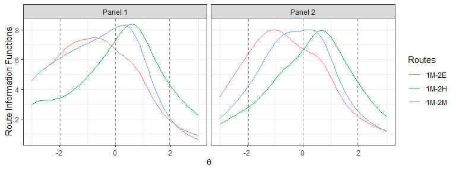
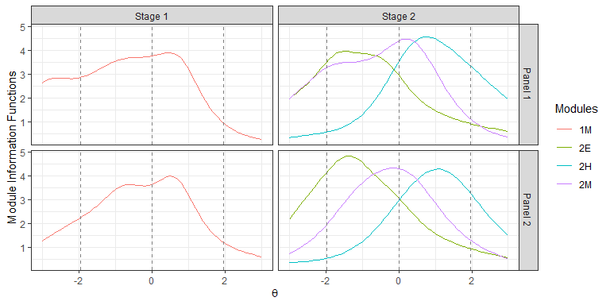
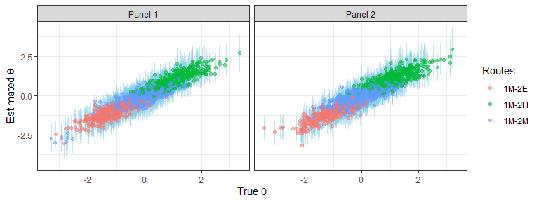
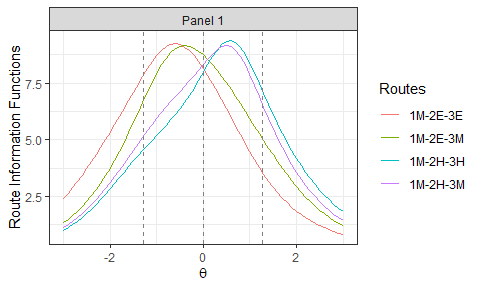
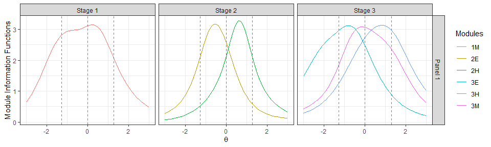
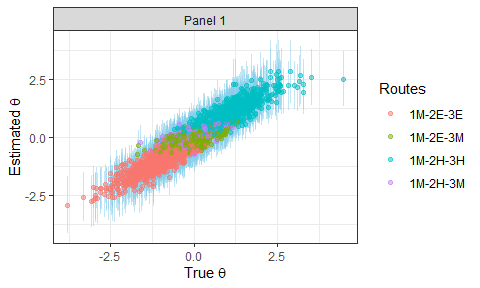

#### Book Chapter: Build high-quality MST panels in R

First we setup the working environment by importing some packages and
writing helper functions.

``` r
# load packages
library(Rirt)
library(Rmst)
library(dplyr, warn.conflicts=FALSE)
library(ggplot2, warn.conflicts=FALSE)
library(reshape2, warn.conflicts=FALSE)
set.seed(112358)

# helper: generate item attributes
gen_attr <- function(n){
  cbind(id=1:n, content=sample(4, n, replace=TRUE), 
        time=round(rlnorm(n, 4.0, .28)), 
        group=sort(sample(n/2, n, replace=TRUE))) 
}
```

#### Generate item pool

Generate an item pool of 600 3PL items, 40 four-category GPCM items, and
40 four-category GRM items.

``` r
# generate item pool
n_3pl <- 600
n_gpcm <- 40
n_grm <- 40
items <- Rirt::model_mixed_gendata(1, n_3pl=n_3pl, n_gpcm=n_gpcm, n_grm=n_grm, n_c=4, a_dist=c(-.77, .33), b_dist=c(-0.86, 1.31), c_dist=c(7, 28), d_dist=c(0, 1))$items
items$'3pl' <- cbind(items$'3pl', gen_attr(n_3pl), type='3PL')
items$'gpcm' <- cbind(items$'gpcm', gen_attr(n_gpcm), type='GPCM')
items$'grm' <- cbind(items$'grm', gen_attr(n_grm), type='GRM')
```

The distributions of item parameters in the generated item pool are:

    ##         a     b    c
    ## mean 0.48 -0.85 0.20
    ## std  0.16  1.24 0.07
    ## min  0.19 -3.00 0.06
    ## max  1.26  3.00 0.50

    ##         a     b d1    d2    d3    d4
    ## mean 0.50 -0.67  0 -0.03  0.08 -0.05
    ## std  0.18  1.13  0  0.62  0.93  0.90
    ## min  0.19 -3.00  0 -1.31 -1.63 -2.25
    ## max  0.95  1.07  0  1.12  2.52  1.91

    ##         a    b1    b2    b3
    ## mean 0.48 -1.59 -0.72  0.31
    ## std  0.13  1.00  0.79  0.86
    ## min  0.21 -5.08 -2.76 -1.17
    ## max  0.82  0.42  1.03  2.32

The distributions of item attributes in the generated item pool are:

    ##         1    2    3    4
    ## 3pl  0.27 0.25 0.24 0.24
    ## gpcm 0.12 0.22 0.40 0.25
    ## grm  0.20 0.25 0.28 0.28

    ##       mean   std min max
    ## 3pl  57.48 17.21  22 135
    ## gpcm 65.33 28.67  31 191
    ## grm  51.85 15.68  29  88

    ##        n mean  std min max
    ## 3pl  264 2.27 1.39   1   8
    ## gpcm  19 2.11 1.10   1   5
    ## grm   16 2.50 1.86   1   8

The test information functions (TIFs) of the entire item pool and by
item types are:

<!-- -->

#### Example 1

Assemble 2 non-overlapping panels of 1-2 MST using the top-down
approach, and solve the model by lp\_solve under a time limit of 15
minutes.

Psychometric requirements:

  - maximize TIF over \[-1.64, 0.00\] in the easy route
  - maximize TIF over \[0.00, 1.64\] in the hard route
  - at least 10 items in Stage 1

Content requirements:

  - 40 items in each route
  - 36 3PL items, 2 GPCM items, and 2 GRM items in each route
  - 9 to 11 items in every one of the four content areas in each route
  - an average response time of 56 to 64 seconds per item in each
route

<!-- end list -->

``` r
x <- mst(items, '1-2', n_panels=2, method='topdown', test_len=40, max_use=1)
x <- mst_objective(x, seq(-1.64, 0, length.out=3), 'max', indices=1)
x <- mst_objective(x, seq(0,  1.64, length.out=3), 'max', indices=2)
x <- mst_constraint(x, 'type', min=36, max=36, level='3PL')
x <- mst_constraint(x, 'type', min=2, max=2, level='GPCM')
x <- mst_constraint(x, 'type', min=2, max=2, level='GRM')
for(i in 1:4)
  x <- mst_constraint(x, 'content', min=9, max=11, level=i)
x <- mst_constraint(x, 'time', min=56*40, max=64*40)
x <- mst_stage_length(x, 1, min=10)
x <- mst_assemble(x, 'lpsolve', time_limit=60*15, message=FALSE)
```

    ## the model is sub-optimal, optimum: 4.178 (5.602, 1.424)

Draw the TIFs of the routes in the assembled 1-2 MST panels.

``` r
plot(x, byroute=TRUE, label=TRUE) + 
  geom_vline(xintercept=seq(-1.64, 1.64, length.out=3), linetype=2, color='gray50')
```

<!-- -->

Draw the TIFs of the modules in the assembled 1-2 MST panels.

``` r
plot(x, byroute=FALSE, label=TRUE) + 
  geom_vline(xintercept=seq(-1.64, 1.64, length.out=3), linetype=2, color='gray50')
```

<!-- -->

Summarize the distributions of the item attributes in each route and
module.

    ##   panel route content1 content2 content3 content4 time n_3pl n_gpcm n_grm
    ## 1     1 1M-2E       11        9        9       11   61    36      2     2
    ## 2     1 1M-2H       11       11        9        9   58    36      2     2
    ## 3     2 1M-2E       11       10        9       10   58    36      2     2
    ## 4     2 1M-2H       11        9        9       11   56    36      2     2

    ##   panel module content1 content2 content3 content4 time n_3pl n_gpcm n_grm
    ## 1     1     1M       10        7        7        7   59    27      2     2
    ## 2     1     2E        1        2        2        4   67     9      0     0
    ## 3     1     2H        1        4        2        2   54     9      0     0
    ## 4     2     1M        7        5        5        3   58    18      2     0
    ## 5     2     2E        4        5        4        7   57    18      0     2
    ## 6     2     2H        4        4        4        8   54    18      0     2

Administer the assembled panels to 3,000 test takers whose true
abilities are sampled from a standard normal distribution in a
Monte-Carlo simulation study. Use the maximum information routing rule.

``` r
true_t <- rnorm(3000, mean=0, sd=1)
est_t <- Map(function(t) mst_sim(x, t, rdp=NULL), true_t)
```

Summarize the overall and by-route and simulation results.

    ## # A tibble: 4 x 7
    ## # Groups:   panel [2]
    ##   panel   route     N n_items  corr  rmse    se
    ##   <chr>   <chr> <int>   <dbl> <dbl> <dbl> <dbl>
    ## 1 Panel 1 1M-2E   631      40 0.839 0.374 0.411
    ## 2 Panel 1 1M-2H   875      40 0.850 0.375 0.394
    ## 3 Panel 2 1M-2E   668      40 0.844 0.357 0.399
    ## 4 Panel 2 1M-2H   826      40 0.848 0.364 0.388

    ## corr rmse 
    ## 0.93 0.37

Visualize the simulation results.

<!-- -->

#### Example 2

Assemble 2 non-overlapping panels of 1-3 MST uisng the bottom-up
approach, and solve the model by lp\_solve under a time limit of 15
minutes.

Psychometric requirements:

  - maximize TIF over \[-0.65, 0.65\] in the M moduels
  - maximize TIF over \[-1.96, -0.65\] in the E moduels
  - maximize TIF over \[ 0.65, 1.96\] in the H moduels

Content requirements:

  - 20 items in each module
  - 18 3PL items, 2 GPCM items, and 2 GRM items in each route
  - 9 to 11 items in every one of the four content areas in each route
  - an average response time of 56 to 64 seconds per item in each
route

<!-- end list -->

``` r
x <- mst(items, '1-3', n_panels=2, method='bottomup', test_len=20, max_use=1)
x <- mst_objective(x, seq(-0.65,  0.65, length.out=3), 'max', indices=c(1,3))
x <- mst_objective(x, seq(-1.96, -0.65, length.out=3), 'max', indices=2)
x <- mst_objective(x, seq( 0.65,  1.96, length.out=3), 'max', indices=4)
x <- mst_constraint(x, 'type', min=18, max=18, level='3PL')
x <- mst_constraint(x, 'type', min=0, max=2, level='GPCM')
x <- mst_constraint(x, 'type', min=0, max=2, level='GRM')
for(i in 1:4)
  x <- mst_constraint(x, 'content', min=4, max=6, level=i)
x <- mst_constraint(x, 'time', min=56*20, max=64*20)
x <- mst_assemble(x, 'lpsolve', time_limit=60*15, message=FALSE)
```

    ## the model is sub-optimal, optimum: 1.716 (3.281, 1.565)

Draw the TIFs of the routes in the assembled 1-3 MST panels.

``` r
plot(x, byroute=TRUE, label=TRUE) + 
  geom_vline(xintercept=seq(-1.96, 1.96, length.out=3), linetype=2, color='gray50')
```

<!-- -->

Draw the TIFs of the modules in the assembled 1-3 MST panels.

``` r
plot(x, byroute=FALSE, label=TRUE) + 
  geom_vline(xintercept=seq(-1.96, 1.96, length.out=3), linetype=2, color='gray50')
```

<!-- -->

Summarize the distributions of the item attributes in each route and
module.

    ##   panel route content1 content2 content3 content4 time n_3pl n_gpcm n_grm
    ## 1     1 1M-2E       10       10        9       11   56    36      4     0
    ## 2     1 1M-2M        9       11        9       11   60    36      4     0
    ## 3     1 1M-2H        9       10       10       11   58    36      4     0
    ## 4     2 1M-2E        9       10       11       10   59    36      4     0
    ## 5     2 1M-2M       10        8       10       12   59    36      4     0
    ## 6     2 1M-2H       11        9        9       11   57    36      4     0

    ##   panel module content1 content2 content3 content4 time n_3pl n_gpcm n_grm
    ## 1     1     1M        4        5        5        6   56    18      2     0
    ## 2     1     2E        6        5        4        5   56    18      2     0
    ## 3     1     2M        5        6        4        5   63    18      2     0
    ## 4     1     2H        5        5        5        5   60    18      2     0
    ## 5     2     1M        5        4        5        6   57    18      2     0
    ## 6     2     2E        4        6        6        4   60    18      2     0
    ## 7     2     2M        5        4        5        6   61    18      2     0
    ## 8     2     2H        6        5        4        5   57    18      2     0

Administer the assembled panels to 3,000 test takers whose true
abilities are sampled from a standard normal distribution in a
Monte-Carlo simulation study. Use the maximum information routing rule.

``` r
true_t <- rnorm(3000, mean=0, sd=1)
est_t <- Map(function(t) mst_sim(x, t, rdp=NULL), true_t)
```

Summarize the overall and by-route and simulation results.

    ## # A tibble: 6 x 7
    ## # Groups:   panel [2]
    ##   panel   route     N n_items  corr  rmse    se
    ##   <chr>   <chr> <int>   <dbl> <dbl> <dbl> <dbl>
    ## 1 Panel 1 1M-2E   379      40 0.801 0.354 0.372
    ## 2 Panel 1 1M-2H   475      40 0.853 0.329 0.378
    ## 3 Panel 1 1M-2M   612      40 0.825 0.363 0.357
    ## 4 Panel 2 1M-2E   311      40 0.826 0.355 0.366
    ## 5 Panel 2 1M-2H   463      40 0.795 0.375 0.385
    ## 6 Panel 2 1M-2M   760      40 0.787 0.353 0.358

    ## corr rmse 
    ## 0.93 0.36

Visualize the simulation results.

<!-- -->

#### Example 3

Assemble 1 panel of 1-2-3 MST using a hybrid approach, and solve the
model by GLPK under a time limit of 15 minutes. In the hybrid approach,
content requirements are controlled holistically at the route level, and
psychometric requirements are controlled locally at the module level.
Block two routes with capricious score change: 1M-2E-3H, 1M-2H-3E. Items
are allowed to be resued up to 3 items.

Psychometric requirements:

  - maximize TIF over \[-0.67, 0.67\] in Module 1M
  - maximize TIF over \[-1.28, 0.00\] in Module 2E
  - maximize TIF over \[ 0.00, 1.28\] in Module 2H
  - maximize TIF over \[-1.28, -0.38\] in Module 3E
  - maximize TIF over \[-0.38, 0.38\] in Module 3M
  - maximize TIF over \[ 0.38, 1.28\] in Module 3H
  - Anchor the TIF intersection of 2E and 2H at 0.00

Content requirements:

  - 40 items in each route
  - 36 3PL items, 2 GPCM items, and 2 GRM items in each route
  - 8 to 12 items in every one of the four content areas in each route
  - an average response time of 54 to 66 seconds per item in each route
  - Each item can be used up to 3
times

<!-- end list -->

``` r
x <- mst(items, '1-2-3', n_panels=1, method='topdown', test_len=40, max_use=3, group='group')
x <- mst_route(x, c(1, 2, 6), "-")
x <- mst_route(x, c(1, 3, 4), "-")
x <- mst_objective(x, seq(-0.67,  0.67, length.out=3), 'max', indices=1, method='bottomup')
x <- mst_objective(x, seq(-1.28,  0.00, length.out=4)[2:3], 'max', indices=2, method='bottomup')
x <- mst_objective(x, seq( 0.00,  1.28, length.out=4)[2:3], 'max', indices=3, method='bottomup')
x <- mst_objective(x, seq(-1.28, -0.38, length.out=3), 'max', indices=4, method='bottomup')
x <- mst_objective(x, seq(-0.38,  0.38, length.out=3), 'max', indices=5, method='bottomup')
x <- mst_objective(x, seq( 0.38,  1.28, length.out=3), 'max', indices=6, method='bottomup')
x <- mst_rdp(x, 0, 2:3, tol=.5)
x <- mst_constraint(x, 'type', min=36, max=36, level='3PL')
x <- mst_constraint(x, 'type', min=2, max=2, level='GPCM')
x <- mst_constraint(x, 'type', min=2, max=2, level='GRM')
for(i in 1:4)
  x <- mst_constraint(x, 'content', min=8, max=12, level=i)
x <- mst_constraint(x, 'time', min=54*40, max=66*40)
x <- mst_assemble(x, 'glpk', time_limit=60*15, message=FALSE)
```

    ## time limit exceeded, optimum: 2.722 (2.932, 0.21)

Draw the TIFs of the routes in the assembled 1-2-3 MST panels.

``` r
plot(x, byroute=TRUE, label=TRUE) + 
  geom_vline(xintercept=seq(-1.28, 1.28, length.out=3), linetype=2, color='gray50')
```

<!-- -->

Draw the TIFs of the modules in the assembled 1-2-3 MST panels.

``` r
plot(x, byroute=FALSE, label=TRUE) + 
  geom_vline(xintercept=seq(-1.28, 1.28, length.out=3), linetype=2, color='gray50')
```

<!-- -->

Summarize the distributions of the item attributes in each route and
module.

    ##   panel    route content1 content2 content3 content4 time n_3pl n_gpcm
    ## 1     1 1M-2E-3E       10       10        9       11   58    36      2
    ## 2     1 1M-2E-3M        9       10        9       12   56    36      2
    ## 3     1 1M-2H-3M        9       11       10       10   54    36      2
    ## 4     1 1M-2H-3H       10       11        9       10   55    36      2
    ##   n_grm
    ## 1     2
    ## 2     2
    ## 3     2
    ## 4     2

    ##   panel module content1 content2 content3 content4 time n_3pl n_gpcm n_grm
    ## 1     1     1M        3        6        5        4   55    18      0     0
    ## 2     1     2E        1        0        2        3   63     4      2     0
    ## 3     1     2H        1        1        3        1   48     4      2     0
    ## 4     1     3E        6        4        2        4   60    14      0     2
    ## 5     1     3M        5        4        2        5   55    14      0     2
    ## 6     1     3H        6        4        1        5   57    14      0     2

Administer the assembled panels to 3,000 test takers whose true
abilities are sampled from a standard normal distribution in a
Monte-Carlo simulation study. Use the maximum information routing rule.

``` r
true_t <- rnorm(3000, mean=0, sd=1)
est_t <- Map(function(t) mst_sim(x, t, rdp=NULL), true_t)
```

Summarize the overall and by-route and simulation results.

    ## # A tibble: 4 x 7
    ## # Groups:   panel [1]
    ##   panel   route        N n_items  corr  rmse    se
    ##   <chr>   <chr>    <int>   <dbl> <dbl> <dbl> <dbl>
    ## 1 Panel 1 1M-2E-3E   923      40 0.847 0.335 0.355
    ## 2 Panel 1 1M-2E-3M   690      40 0.681 0.328 0.340
    ## 3 Panel 1 1M-2H-3H  1057      40 0.848 0.349 0.366
    ## 4 Panel 1 1M-2H-3M   330      40 0.676 0.362 0.345

    ## corr rmse 
    ## 0.94 0.34

Visualize the simulation results.

<!-- -->
